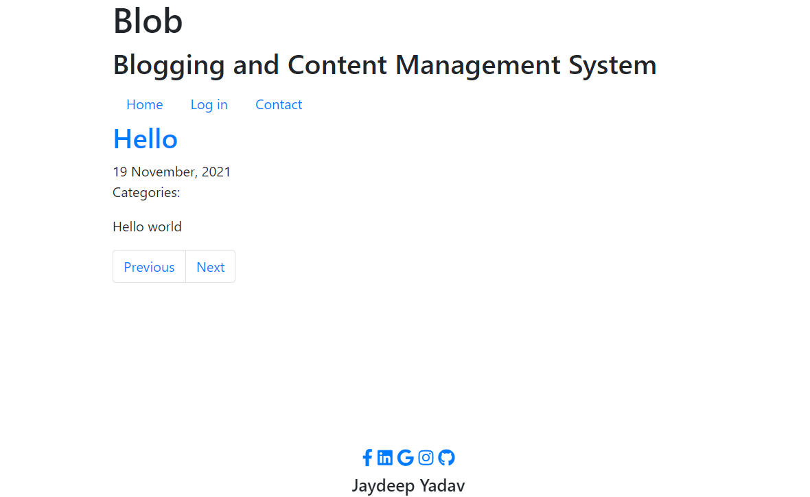

# Blob-Blogging-Website-in-PHP
## This project is Based on PHP 

## Steps to run this project

1. Create a database named 'cms'
2. Import 'cms.sql' present in root directory to database.
3. Place all the files to htdocs folder in Xampp.
4. Open Xampp and start PHP and Apache Server.
5. Open localhost in browser.
